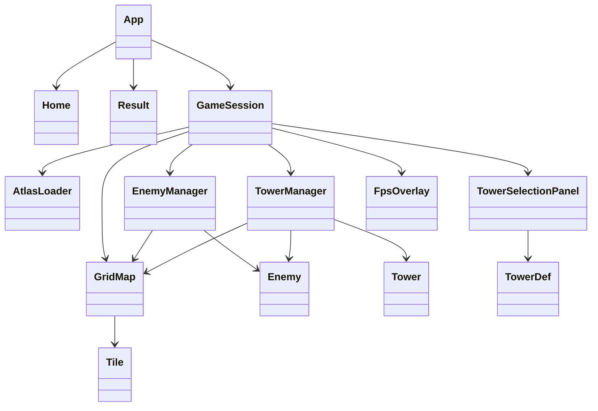

# 2026 OOPL Final Report

## 組別資訊

組別：57
組員：盧沛源、楊承諭
復刻遊戲：Infinitode 2

## 專案簡介

### 遊戲簡介

本專案以 Infinitode 2 的塔防玩法為參考，使用 C++17 與 PTSD framework 製作 2D 塔防遊戲。玩家從首頁點選 New game 進入遊戲後，會依序挑戰五個關卡。每個關卡由 CSV 地圖、關卡設定、敵人波次、塔與子彈系統組成。

遊戲的核心規則是：敵人會從地圖上的出生點格出現，沿著程式以 BFS 從 Spawn 到 Goal 找出的固定路徑前進；玩家只能在 Platform 格上建塔。敵人抵達 Goal 後會扣除基地生命，基地生命歸零時進入結算畫面。若清完目前關卡所有波次且場上沒有敵人，系統會依關卡規則進入下一關或進入無限循環。

目前實作的可建造塔共有三種：

| 塔 | 建造費用 | 攻擊範圍 | 射擊間隔 | 傷害 | 子彈速度 | 額外效果 |
|---|---:|---:|---:|---:|---:|---|
| Basic | 39 | 7.0 | 0.35 秒 | 15 | 9.0 | 單體攻擊 |
| Sniper | 79 | 14.0 | 1.20 秒 | 70 | 16.0 | 單體攻擊 |
| Cannon | 99 | 6.0 | 1.50 秒 | 45 | 7.0 | 1.5 格爆炸範圍 |

敵人類型包含 Regular、Fast、Strong、Heli、Jet、Armored、Healer、Toxic、Icy、Fighter、Light 等。程式的實際戰鬥流程目前會使用敵人的血量、速度、移動型態、抵達基地傷害、擊殺獎勵金幣與貼圖。

### 組別分工

| 成員 | 主要貢獻 | 比例 |
|---|---|---|
| 盧沛源 | 負責整體專案核心架構與主流程設計，包含 `App` 狀態機、`GameSession` 單局管理、關卡系統與 `LevelConfig` 架構設計、關卡接續流程、敵人派發邏輯、`GridMap` 地圖讀取與建構、地圖渲染、滑鼠座標與地圖格座標轉換、敵人 BFS 巡路、`EnemyManager` 敵人管理基礎、`TowerManager` 塔管理基礎、基礎塔建構、子彈射擊與命中邏輯、atlas 精靈圖讀取與裁切工具、首頁流程與首頁 UI 基礎、FPS 顯示、測試切關按鈕與測試輔助功能、CMake 建置設定調整 | 50% |
| 楊承諭 | 負責玩法內容與關卡資料擴充，包含塔類別與塔防玩法調整、選塔面板與塔種切換 UI、塔圖示與費用顯示、`LevelConfig` 內的關卡參數與波次資料新增完善、不同關卡的起始生命、起始金幣、清波獎勵與敵人組合配置、敵人類型與數值資料擴充、後期敵人種類導入、無限循環倍率與循環關卡功能擴充、地圖內容繪製與調整、結算 UI、分數計算呈現、星等顯示、Return to Home 流程，以及後期關卡大量波次與高難度敵人生成資料設計、加入遊戲 BGM | 50% |

## 遊戲介紹

### 遊戲規則

1. 啟動後進入首頁，設有 Music player、Settings、Handbook 及 About 等功能選單。
2. 點擊 New game 後從第 1 關開始。
3. 玩家可以用右下角選塔面板選擇 Basic、Sniper、Cannon，也可以用數字鍵 1、2、3 切換。
4. 滑鼠左鍵點擊地圖時，若點到選塔面板就切換塔；若點到可建塔的 Platform 格且金幣足夠，就在該格建塔。
5. 按 X 或滑鼠右鍵單擊可以拆除滑鼠所在格子的塔，退還該塔建造費用的一半。
6. WASD 可以平移地圖，滑鼠右鍵拖曳也可以平移地圖，滑鼠滾輪或鍵盤 Q/E 鍵可以縮放地圖。縮放倍率限制在 0.1 到 3.0。
7. 敵人會依每關 `LevelConfig` 的 `WaveConfig` 與 `SpawnGroup` 依序生成。每波會先等待 `prepTime`，每個 group 再依 `startDelay` 與 `interval` 生成敵人。
8. 每隻敵人沿著對應 Spawn 到 Goal 的 BFS 最短路徑移動。若 `spawnPointIndices` 為空，該 group 會在所有起點各生成一隻敵人。
9. 塔會自動瞄準攻擊範圍內最近的存活敵人，發射具有尋向效果的子彈。子彈命中後造成傷害；Cannon 的子彈會對爆炸半徑內敵人造成範圍傷害。
10. 擊殺敵人會獲得該敵人設定的 `rewardGold`；清空一波敵人會獲得該波 `clearRewardGold`。
11. 敵人抵達終點會依敵人設定的 `damageToBase` 扣基地生命；任何時候（包括循環模式中）若基地生命歸零，則遊戲結束並以當前累積分數進入結算畫面（無法自動前往下一關）。
12. 第 1 關完成所有波次後會自動進入第 2 關。第 2 關以後完成首輪所有波次後會進入無限循環，敵人血量乘上 `1.2^loopCount`，速度乘上 `1.1^loopCount`；第 2~4 關完成首輪後會顯示前往下一關按鈕，玩家必須點擊該按鈕才能進入下一關。第 5 關完成首輪後也會顯示同一顆按鈕，點擊後因沒有下一關而進入結算畫面。若玩家不點擊按鈕繼續挑戰並因生命歸零而死亡，則只會進入結算畫面而非自動前往下一關；作弊模式下按 P 鍵可提前顯示目前關卡可用的切關或結算按鈕。
13. 遊戲中按 M 鍵（或於首頁點選 Settings）可以呼叫設定彈窗，調整音樂音量並暫停遊戲。
14. 遊戲內可開啟作弊模式（Cheat Mode）。玩家必須先在 Settings 彈窗中開啟作弊權限（顯示為 Cheat Mode: ON），接著才能在遊戲中按 F1 鍵實際開啟或關閉作弊功能。啟用後可以使用 G（加 100 金幣）、H（加 1 條命）、P（顯示切關或結算按鈕）等作弊按鍵。進入作弊模式時，會在畫面下方中間顯示特別的街機搖桿圖示。
15. 遊戲中支援切換進行速度（1倍速、2倍速、3倍速），可以使用 J 減速、K 暫停/恢復、L 加速；畫面右上角會顯示對應的速度圖示，點擊該圖示可依序切換速度檔位，長按該圖示則可暫停或恢復遊戲。


### 關卡內容

關卡資料集中在 `src/game/LevelConfig.cpp`。每關起始生命、金幣、地圖與波次如下：

| 關卡 | 地圖檔 | 地圖大小 | 起始生命 | 起始金幣 | 波次數 | 備註 |
|---|---|---:|---:|---:|---:|---|
| 1 | `assets/maps/map_01.csv` | 7 x 3 | 20 | 120 | 3 | 教學型短地圖，Regular、Fast、Strong 為主 |
| 2 | `assets/maps/map_02.csv` | 10 x 10 | 20 | 160 | 5 | 加入 Heli 等飛行敵人與更多混合波 |
| 3 | `assets/maps/map_03.csv` | 29 x 30 | 1 | 200 | 6 | 高壓大量敵人波次，後段包含 100 與 500 隻級別的 group 設定 |
| 4 | `assets/maps/map_04.csv` | 27 x 39 | 100 | 200 | 5 | 多敵種混合，包含 Armored、Healer、Toxic、Icy、Fighter 等 |
| 5 | `assets/maps/map_05.csv` | 51 x 51 | 1 | 200 | 6 | 城市路口大型地圖，使用程式產生大量 spawn group 與指定出生點 |

### 分數與星等

每次通關或死亡時，`App::calcLevelScore()` 會把當前關卡分數加入總分。分數計算方式如下：

```
本關分數 = 剩餘生命 + floor(剩餘金幣 / 1000) + 關卡固定獎勵
```

關卡固定獎勵依關卡與循環次數計算：

| 關卡 | 第一輪固定獎勵 | 每完成一輪循環增加 |
|---|---:|---:|
| 1 | 10 | 0 |
| 2 | 15 | 5 |
| 3 | 50 | 25 |
| 4 | 25 | 10 |
| 5 | 60 | 20 |

如果基地死亡，該關仍會計入分數，但生命分數固定以 0 計算，只會加上剩餘金幣分數與關卡獎勵。結算畫面的星等門檻為：

| 星等 | 分數門檻 |
|---|---:|
| 1 星 | 330 |
| 2 星 | 660 |
| 3 星 | 1000 |

### 遊戲畫面

目前遊戲包含三個主要畫面：

1. 首頁畫面：仿 Infinitode 2 的深色 UI，顯示使用者區塊、資源數字與多個功能按鈕；實際可點擊的開始按鈕為 New game。
2. 遊戲畫面：包含地圖、敵人、塔、子彈、右下角選塔面板、左上基地生命、上方波次、右上金幣、速度控制圖示、左下 FPS。
3. 結算畫面：顯示 GAME OVER、Score、星等、Waves Survived，以及 Return to Home 按鈕；若尚未達到三星，會額外顯示距離下一星所需分數。

## 程式設計

### 程式架構

本專案採用由外而內的分層架構。最外層的 `main.cpp` 僅負責建立 PTSD 的執行環境、維持主迴圈，並依照 `App::State` 呼叫對應的生命週期函式；實際遊戲狀態、畫面切換與關卡流程則集中在 `App` 中管理。此設計將應用程式流程與具體遊戲邏輯分離，使主迴圈不需理解敵人移動、塔攻擊、地圖渲染或 UI 操作等細節，降低模組之間的耦合。

| 類別 / 模組 | 位置 | 職責 |
|---|---|---|
| `main.cpp` | `src/main.cpp` | 建立 PTSD `Core::Context`，依 `App::State` 執行 Start、Update、End |
| `App` | `include/App.hpp`, `src/App.cpp` | 管理 HOME、GAME、RESULT、END 狀態，處理輸入、關卡切換、總分與結算 |
| `GameSession` | `include/game/GameSession.hpp`, `src/game/GameSession.cpp` | 管理單一關卡的地圖、敵人、塔、HUD、波次生成、無限循環與遊戲勝敗 |
| `LevelConfig` | `include/game/LevelConfig.hpp`, `src/game/LevelConfig.cpp` | 定義關卡、波次、敵人 group，並在啟動時驗證地圖與配置合法性 |
| `GridMap` | `include/map/GridMap.hpp`, `src/map/GridMap.cpp` | 讀取 CSV 地圖、解析尺寸與描述、建立格子渲染物件、提供座標轉換與鏡頭控制 |
| `Tile` | `include/map/Tile.hpp`, `src/map/Tile.cpp` | 依 spriteId 前綴解析 Empty、Road、Platform、Wall、Spawn、Goal |
| `Enemy` | `include/enemy/Enemy.hpp`, `src/enemy/Enemy.cpp` | 保存單一敵人的位置、速度、生命、路徑索引、傷害、獎勵與移動行為 |
| `EnemyManager` | `include/enemy/EnemyManager.hpp`, `src/enemy/EnemyManager.cpp` | 由地圖建立 Spawn 到 Goal 的 BFS 路徑、生成敵人、更新敵人、同步敵人渲染並結算死亡/抵達終點 |
| `TowerDef` | `include/tower/TowerDef.hpp` | 定義三種塔的費用、射程、攻速、傷害、子彈速度與爆炸半徑 |
| `Tower` | `include/tower/Tower.hpp`, `src/tower/Tower.cpp` | 保存塔的位置、等級、射程、砲口朝向與 spriteId |
| `TowerManager` | `include/tower/TowerManager.hpp`, `src/tower/TowerManager.cpp` | 建塔、拆塔、記錄塔種類、冷卻、子彈，並執行自動瞄準與命中判定 |
| `AtlasLoader` | `include/utils/AtlasLoader.hpp`, `src/utils/AtlasLoader.cpp` | 解析 `combined.atlas`，從大圖裁切 sprite 成暫存 BMP，並以快取避免重複建立圖片 |
| `TowerSelectionPanel` | `include/utils/TowerSelectionPanel.hpp`, `src/utils/TowerSelectionPanel.cpp` | 繪製右下角三格選塔面板、費用文字、選取高亮與滑鼠 hit test |
| `FpsOverlay` | `include/utils/FpsOverlay.hpp`, `src/utils/FpsOverlay.cpp` | 在遊戲畫面左下角顯示 FPS |
| `Home` | `include/ui/Home.hpp`, `src/ui/Home.cpp` | 建立首頁 UI、按鈕 layout、hover 與點擊判斷 |
| `Result` | `include/ui/Result.hpp`, `src/ui/Result.cpp` | 建立結算 UI、分數、星等與回首頁按鈕 |

進入遊戲後，`App` 以 `GameSession` 表示單一關卡的執行環境。`GameSession` 內部再組合 `GridMap`、`EnemyManager`、`TowerManager`、`TowerSelectionPanel` 與 `FpsOverlay` 等子系統，使單局狀態的資料所有權集中於同一個物件。當關卡完成並切換至下一關時，`App` 會重新建立新的 `GameSession`，舊關卡所持有的地圖、敵人、塔、HUD 與 UI 資源會隨物件生命週期一併釋放，避免不同關卡之間殘留狀態。

地圖系統由 `GridMap` 與 `Tile` 負責。`GridMap` 封裝 CSV 讀取、地圖尺寸、鏡頭偏移、縮放倍率、格子渲染以及座標轉換；`Tile` 則將 spriteId 解析為 Road、Platform、Spawn、Goal 等邏輯類型。其他系統若需要判斷建塔或行走規則，皆透過 `canBuildTower()`、`canWalk()`、`worldToGrid()`、`gridToWorld()` 等公開介面取得結果，而不直接依賴地圖內部資料結構。此設計使地圖規則、渲染資料與座標換算集中在同一模組中維護。

敵人系統拆分為單一敵人資料與群體管理兩個層次。`Enemy` 保存位置、速度、生命值、路徑索引與抵達狀態，並負責沿固定路徑更新自身位置；`EnemyManager` 則負責建立 Spawn 到 Goal 的 BFS 路徑、生成敵人、同步敵人顯示物件，以及在每幀結算死亡與抵達終點的敵人。透過此分工，單一敵人的行為與敵人集合的生命週期管理彼此分離，便於維護波次生成與場上敵人清理流程。

塔系統由 `Tower`、`TowerDef` 與 `TowerManager` 共同構成。`Tower` 保存塔在地圖上的位置、射程與砲口角度；`TowerDef` 以資料表方式描述 Basic、Sniper、Cannon 的建造費用、攻擊距離、射擊間隔、傷害、子彈速度與爆炸半徑；`TowerManager` 則負責建塔、拆塔、冷卻計時、尋敵、建立 projectile 與命中判定。這種設計將不同塔種的數值差異抽象成資料，攻擊流程則由管理器統一執行，避免為相似行為建立重複邏輯。

玩家輸入與底層遊戲狀態之間也維持明確邊界。以建塔為例，`App` 僅負責判斷滑鼠點擊位置與目前選取的塔種，實際建塔流程由 `GameSession::placeTower()` 封裝：先檢查金幣是否足夠，再委派 `TowerManager` 驗證格子是否合法，建塔成功後才扣除金幣並更新 HUD。此流程讓建塔行為具有單一入口，降低資料不一致的可能性。

每幀更新流程由 `GameSession` 統籌。`GameSession` 先推進波次計時並依設定生成敵人，再呼叫 `EnemyManager` 更新敵人位置，接著由 `TowerManager` 依敵人列表執行自動攻擊與 projectile 更新。最後，`EnemyManager` 回報本幀死亡與抵達終點的敵人，`GameSession` 根據回報結果更新基地生命、金幣與關卡狀態。整體流程中，各物件透過公開方法交換結果，避免未受控的跨模組狀態修改。

資源與生命週期管理方面，專案使用 `std::unique_ptr` 表示單一所有權，例如 `App` 擁有目前的 `Home`、`GameSession` 或 `Result`，`GameSession` 擁有地圖、敵人管理器與塔管理器。渲染物件則使用 `std::shared_ptr` 與 renderer 共同持有。`AtlasLoader` 裁切 atlas 時也使用帶有自訂 deleter 的 `std::unique_ptr` 管理 SDL surface，確保暫存資源能在離開作用域時正確釋放。

程式中保留了繼承與多型的擴充方向。`Tower` 宣告 virtual destructor 與多個 virtual getter/setter，專案內亦存在 `AmmoTower`、`AroundSkillTower` 類別。不過依目前實際遊戲流程，塔主要以 `std::vector<Tower>` 搭配 `TowerId` / `TowerDef` 運作，`AmmoTower` 與 `AroundSkillTower` 尚未接入主要攻擊流程。因此本版本的主要架構以封裝、組合、資料抽象與管理器分工為主，繼承類別則作為後續擴充塔行為的基礎。

目前主流程中的主要物件關係如下：



由上圖可見，`GameSession` 是單局遊戲的組合根節點，`App` 則負責更上層的流程控制。地圖、敵人、塔、UI 與資源載入各自維持獨立責任，並透過公開介面進行協作。

### 程式技術

#### 1. 狀態機式主流程

`App` 使用 `State::START`、`HOME`、`GAME`、`RESULT`、`END` 表示應用程式生命週期。`main.cpp` 的主迴圈僅依狀態呼叫 `Start()`、`Update()`、`End()`，狀態轉移集中於 `App` 內部，使首頁、遊戲中與結算流程具有清楚邊界。

#### 2. 以配置資料驅動關卡

關卡資料由 `LevelConfig`、`WaveConfig`、`SpawnGroup` 描述，而非直接散布於遊戲更新流程中。每個關卡配置地圖檔、起始生命、起始金幣與波次內容。`validateLevelConfigs()` 會於啟動時檢查關卡編號、地圖路徑、波次資料、group count、生成延遲與間隔是否合法，使設定錯誤能在遊戲開始前被攔截。

#### 3. CSV 地圖與 Tile 前綴解析

`GridMap` 讀取 CSV 前三行作為地圖名稱、描述與難度，後續資料則作為 tile spriteId。`Tile` 透過 spriteId 前綴解析邏輯類型，例如 `tile-type-platform*` 對應可建塔格，`tile-type-road*` 對應可行走道路，`tile-type-spawn*` 對應出生點，`tile-type-target*` 或 `tile-type-game-value-base` 對應終點。

#### 4. BFS 固定路徑

`EnemyManager::buildPathsFromMap()` 會對每個 Spawn 執行 BFS，找出通往 Goal 的最短路徑。每條路徑以 `shared_ptr<const vector<pair<int,int>>>` 保存，敵人生成時共享同一份路徑資料，避免為每隻敵人重複複製完整路徑。

#### 5. 座標系統與鏡頭縮放

地圖邏輯以格子座標為基礎，顯示時透過 `gridToWorld()` 轉換為 PTSD/OpenGL 使用的中心座標系。`worldToGrid()` 則將滑鼠座標轉回格子座標，用於建塔與拆塔判定。相機平移與縮放由 `GridMap` 統一管理，塔、敵人、子彈與 HUD 依目前 offset 與 scale 同步顯示。

#### 6. 自動攻擊與追蹤子彈

`TowerManager` 每幀更新塔的冷卻時間，並讓可攻擊的塔搜尋射程內最近的有效敵人。塔在攻擊時會更新砲口角度並生成 projectile。Projectile 具有 2 秒 lifetime、0.22 命中半徑與 6.0 尋敵半徑，飛行途中會朝最近敵人修正方向。若 projectile 設有 `splashRadius`，命中時會對爆炸範圍內所有存活且尚未抵達終點的敵人造成傷害。

#### 7. HUD 與 UI 分層

地圖、地面敵人、空中敵人、塔、子彈、HUD 與選塔面板分別使用不同 z-index。`GameSession::display()` 依序繪製地圖、塔、子彈、敵人、HUD、選塔面板與 FPS，使操作介面維持在遊戲物件上層。

#### 8. RAII 與智慧指標

專案使用 `std::unique_ptr` 管理具單一所有權的核心物件，例如 `GameSession`、`GridMap`、`EnemyManager`、`TowerManager` 與 `AtlasLoader`。畫面物件則以 `std::shared_ptr` 交由 renderer 與容器共同持有。`AtlasLoader` 裁切 atlas 時使用 `std::unique_ptr<SDL_Surface, decltype(&SDL_FreeSurface)>` 管理 SDL surface，降低手動釋放資源的風險。

#### 9. Debug / 測試輔助功能

- 遊戲畫面左下角顯示 FPS overlay。
- 在 Cheat Mode 啟用後，按 G 可增加 100 金幣，按 H 可增加 1 點基地生命。
- 在 Cheat Mode 啟用後，按 P 可顯示目前關卡可用的切關或結算按鈕，用於測試關卡切換與結算流程。
- `spawnDebugEnemy()` 可依指定敵人類型與出生點生成測試敵人。
- 使用 PTSD logger 輸出分數、關卡完成、遊戲結束與流程狀態。
- Debug build 下遇到未知 tile 類型會丟出例外，避免錯誤地圖資料被靜默處理。

### 使用到 AI/AI Agent 的部分
盧沛源：
- OpenAI Codex 協助專案架構設計構想
- 撰寫時開啟 GitHub Copilot inline auto-completion

楊承諭：
- Gemini 3 Pro 協助程式碼生成與除錯，主要負責生成程式碼雛形與重構，於開發前期使用。
- Antigravity AI IDE 協助程式碼生成、除錯與優化，主要提供完整程式碼與 commit 訊息產生，於開發後期使用。
- 使用 Suno AI 與 Gemini 協助生成遊戲 BGM。

## 結語

### 問題與解決方法

| 問題 | 解決方法 |
|---|---|
| 地圖座標與螢幕座標不同，容易造成點擊格子錯位 | 在 `GridMap` 中集中實作 `worldToGrid()` 與 `gridToWorld()`，並讓鏡頭 offset、scale 都由地圖管理 |
| 多起點地圖需要讓敵人正確找到終點 | `EnemyManager` 對每個 Spawn 用 BFS 建立固定最短路徑，生成敵人時依 spawn index 綁定對應路徑 |
| 關卡資料越來越大，硬寫在遊戲迴圈會難以維護 | 使用 `LevelConfig`、`WaveConfig`、`SpawnGroup` 把關卡資料獨立出來，並提供啟動時驗證 |
| 塔、敵人、子彈與 HUD 都需要跟著鏡頭移動縮放 | 每幀以地圖目前 offset 與 scale 更新顯示位置，邏輯座標仍維持格子座標 |
| Atlas 大圖中的 sprite 需要被 PTSD `Image` 使用 | `AtlasLoader` 解析 atlas bounds，裁切成暫存 BMP 後再建立 `Util::Image`，並用快取避免重複裁切 |
| 關卡完成後需要同時支援下一關、無限循環與最終結算 | 第 1 關完成後直接進下一關；第 2 關以後完成一輪後進入循環，並依循環次數提高敵人血量與速度；第 2~4 關可透過按鈕前往下一關，第 5 關點擊同一按鈕後進入結算 |
| 結算分數需要跨關卡累積 | `App` 保存 `m_Score`，每次通關或死亡時用 `calcLevelScore()` 加上本關分數，再建立 `Result` 顯示 |

### 自評

| 項次 | 項目 | 完成 |
|---:|---|---|
| 1 | 完成首頁、遊戲、結算三段主流程 | V |
| 2 | 完成五個關卡配置與地圖載入 | V |
| 3 | 完成敵人波次生成與關卡循環機制 | V |
| 4 | 完成地圖 CSV 讀取、Tile 類型解析與地圖渲染 | V |
| 5 | 完成 Spawn 到 Goal 的 BFS 敵人巡路 | V |
| 6 | 完成 Basic、Sniper、Cannon 三種可建造塔 | V |
| 7 | 完成塔的自動尋敵、轉向、射擊與 projectile 命中判定 | V |
| 8 | 完成 Cannon 範圍傷害 | V |
| 9 | 完成建塔、拆塔與拆塔退還一半金幣 | V |
| 10 | 完成 HUD：生命、金幣、波次、FPS、速度圖示與作弊模式提示圖示 | V |
| 11 | 完成右下角選塔面板與滑鼠 hit test | V |
| 12 | 完成相機 WASD 移動、右鍵拖曳、滾輪縮放與 Q/E 鍵縮放 | V |
| 13 | 完成分數計算與星等顯示 | V |
| 14 | 完成 atlas 精靈圖讀取、裁切與快取 | V |
| 15 | 完成專案可成功編譯 | V，已執行 `cmake --build build -j2` 並成功建置 `Infinitode-2` |
| 16 | 完成專案權限改為 public | 未由本機程式碼判斷；README 的遠端連結為 GitHub repository |
| 17 | 具有 debug mode 的功能 | V，實作了完整的作弊模式（Cheat Mode），需先於 Settings 開啟權限後透過 F1 鍵啟用，啟用後能用 G/H/P 鍵增加資源或顯示切關/結算按鈕，並於畫面顯示圖示提示。 |
| 18 | 確保專案沒有 Memory Leak 的問題 | 已完成：已全面使用 RAII、`unique_ptr`、`shared_ptr` 管理資源 |
| 19 | 報告中沒有任何錯字，以及沒有任何一項遺漏 | V，已依目前程式碼完成校對與內容比對 |
| 20 | 報告至少保持基本的美感，人類可讀 | V |

### 心得

這次專案最有收穫的地方，是把塔防遊戲拆成多個彼此負責範圍清楚的物件。`App` 不直接管理敵人的移動細節，`GameSession` 不直接解析 atlas，`TowerManager` 不處理 UI，這讓功能雖然越加越多，仍然可以從類別名稱看出主要責任。

實作中也遇到許多塔防遊戲常見但一開始容易低估的問題，例如地圖座標與畫面座標的轉換、多起點路徑、關卡資料驗證、子彈顯示與邏輯同步、關卡循環倍率，以及 UI 物件的 z-index。這些問題如果直接用單一大檔案處理，很快會變得難以維護；改成用 `GridMap`、`EnemyManager`、`TowerManager`、`LevelConfig` 等類別拆開後，才比較容易逐步擴充。

目前專案已具備可玩的完整塔防流程，但仍有可以繼續完善的地方，例如把 `EnemyTypeConfig` 中的特殊能力真正接到 `Enemy` 更新流程、加入更多塔種、讓 debug mode 變成正式選單、補上自動化測試與 sanitizer 檢查。

### 貢獻比例

| 成員 | 主要貢獻 | 比例 |
|---|---|---|
| 盧沛源 | 負責整體專案核心架構與主流程設計，包含 `App` 狀態機、`GameSession` 單局管理、關卡系統與 `LevelConfig` 架構設計、關卡接續流程、敵人派發邏輯、`GridMap` 地圖讀取與建構、地圖渲染、滑鼠座標與地圖格座標轉換、敵人 BFS 巡路、`EnemyManager` 敵人管理基礎、`TowerManager` 塔管理基礎、基礎塔建構、子彈射擊與命中邏輯、atlas 精靈圖讀取與裁切工具、首頁流程與首頁 UI 基礎、FPS 顯示、測試切關按鈕與測試輔助功能、CMake 建置設定調整 | 50% |
| 楊承諭 | 負責玩法內容與關卡資料擴充，包含塔類別與塔防玩法調整、選塔面板與塔種切換 UI、塔圖示與費用顯示、`LevelConfig` 內的關卡參數與波次資料新增完善、不同關卡的起始生命、起始金幣、清波獎勵與敵人組合配置、敵人類型與數值資料擴充、後期敵人種類導入、無限循環倍率與循環關卡功能擴充、地圖內容繪製與調整、結算 UI、分數計算呈現、星等顯示、Return to Home 流程，以及後期關卡大量波次與高難度敵人生成資料設計、加入遊戲 BGM | 50% |
